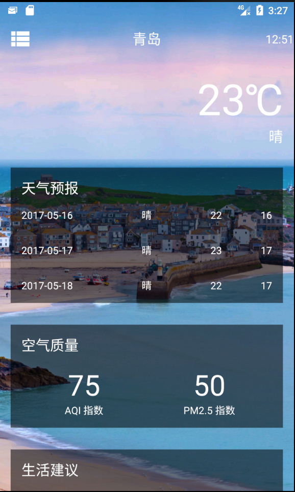
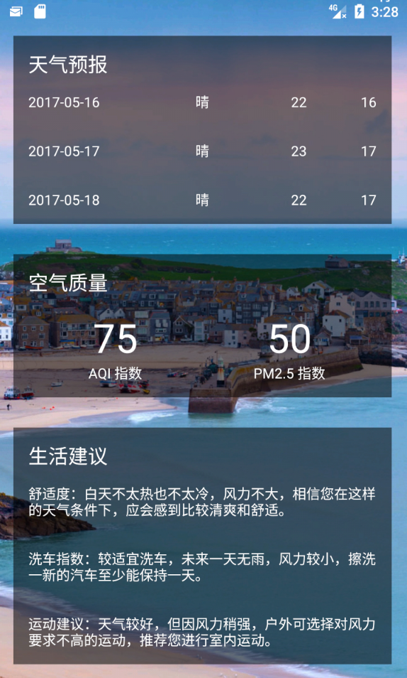
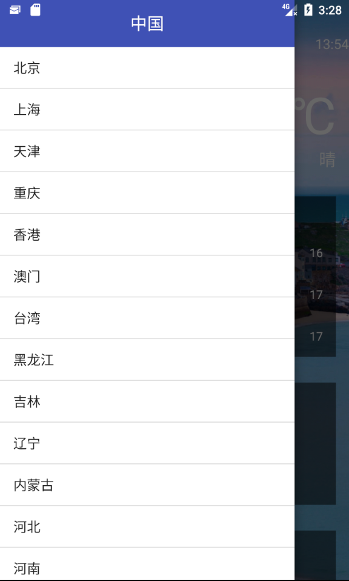

# NiceWeather
An app for displays weather in China
Completed function that app can automatic changing background image everyday.
All of this background image is automatic getting from image of Bing everyday.

Environment: Android Studio 2.2, Java

API:https://www.heweather.com/documents

## Libraries:
    LitePal,
    OkHttp3,
    GSON,
    Glide
## screenshots
  
## Thanks
Pictures of background are getting from Bing:https://www.bing.com/

